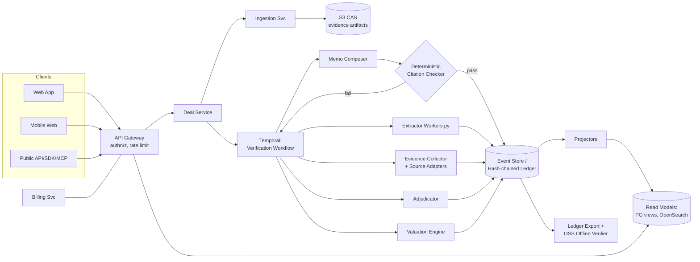
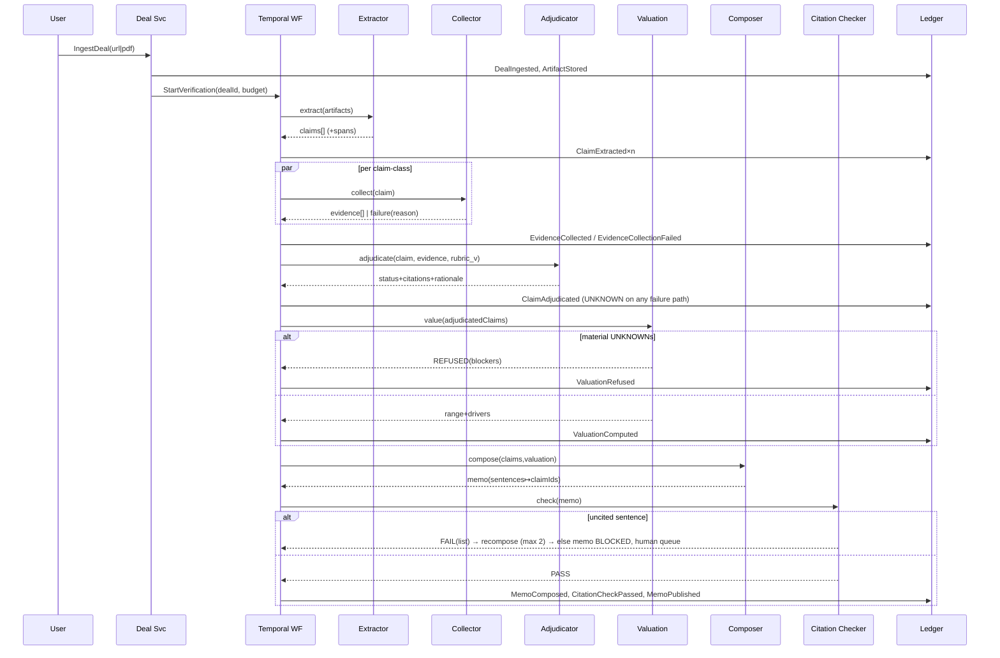

# DealPilot — System Design
Status: Approved · Owner: CTO · Companions: `infrastructure.md`, `ai-architecture.md`, `security.md`, `../engineering/api.md`.

## 1. Architecture at a Glance

Modular services on a shared platform: TypeScript (Fastify) for product/API services, Python for extraction/verification workers, **Temporal** for long-running verification workflows, **Postgres** as system of record (including the append-only event store), **Kafka** for the event backbone, **S3 (object-lock)** as content-addressed evidence storage, **Redis** for cache/queues-lite, **OpenSearch** for search, **pgvector→Qdrant** for embeddings.

## 2. Domain-Driven Design

### 2.1 Bounded Contexts

| Context | Responsibility | Owns | Talks to |
|---|---|---|---|
| **Deal Management** | Deals, pipelines, workspaces, lifecycle | Deal, Pipeline aggregates | all via events |
| **Evidence** | Artifacts, sources, adapters, provenance | EvidenceItem, SourceAdapter registry | Verification |
| **Verification** (core domain) | Claims, adjudication, rubric, statuses | Claim aggregate, Rubric | Evidence, Valuation |
| **Valuation** | Methods, ranges, sensitivities, assumptions | ValuationRun | Verification (reads adjudicated claims only) |
| **Memo** | Composition, citation checking, exports | Memo aggregate | Verification, Ledger |
| **Ledger** (core) | Append-only chain, export, verification | Event stream | everyone (write-through) |
| **Identity & Access** | Orgs, users, roles, sessions | Org, Membership | Gateway |
| **Billing** | Plans, entitlements, credit ledger | Subscription, CreditLedger | Stripe, Gateway |
| **Review** | Approvals, attestations, overrides | ReviewCase | Memo, Ledger |

Context map: Verification and Ledger are **core domains** (highest rigor: event-sourced, mutation-tested). Evidence is **supporting** with an anti-corruption layer per external source (adapters translate foreign schemas → canonical EvidenceItem; external quirks never leak inward). Billing/Identity are **generic** (buy > build where sane).

### 2.2 Event Storming (condensed outcome)

Pivotal events discovered (past-tense, ledger-recorded): `DealIngested → ArtifactStored → ClaimExtracted → EvidenceRequested → EvidenceCollected | EvidenceCollectionFailed → ClaimAdjudicated → ContradictionDetected → ValuationComputed | ValuationRefused → MemoComposed → CitationCheckPassed|Failed → MemoPublished → ReviewRequested → MemoApproved|Overridden → LedgerExported`. Hotspots (marked during storming, resolved in ADRs): rubric versioning vs open claims (ADR-007), partial-evidence valuation semantics (fail-closed, ADR-009), user-asserted claim trust level (ADR-011).

### 2.3 Aggregates & Invariants

| Aggregate | Root | Key invariants (enforced in domain layer, tested) |
|---|---|---|
| Deal | DealId | one active VerificationRun at a time; artifacts immutable/versioned |
| Claim | ClaimId | must reference source span; status transitions only via rubric-tagged AdjudicationEvent; CONTRADICTED requires ≥2 cited evidence hashes (both sides) |
| EvidenceItem | sha256 | provenance fields mandatory (non-null constraint); content-addressed identity |
| ValuationRun | RunId | cannot COMPLETE with material UNKNOWN inputs → REFUSED state; every output figure maps to claimIds/assumptions |
| Memo | MemoId | cannot reach PUBLISHED without CitationCheckPassed for current revision |
| ReviewCase | CaseId | attestation immutable; override appends, never mutates |
| CreditLedger | OrgId | balance = fold(events); never negative without authorized overdraft event |

### 2.4 Commands / Events / Queries (CQRS)

Commands (imperative, validated, may reject): `IngestDeal, ExtractClaims, CollectEvidence, AdjudicateClaim, ComputeValuation, ComposeMemo, PublishMemo, ApproveMemo, OverrideStatus, GrantCredits, ConsumeCredits`.
Events: the storming list above — **events are the write model.**
Queries hit read models only: `GetDealSummary, ListClaimsByStatus, GetMemo, SearchDeals, GetLedgerExport, GetCreditBalance`.

## 3. Event Sourcing Analysis & Decision

**Event-sourced:** Ledger (by definition), Claim, Memo, ReviewCase, CreditLedger — domains where *history is the product* (audit, replay, attestation, money). **State-stored (plain tables + outbox events):** Identity, org settings, pipeline metadata — history has no product value; ES would be ceremony.

Implementation: single Postgres `ledger_events` table per org partition — `(seq bigint, org_id, stream_id, type, payload jsonb, actor, model_versions jsonb, prev_hash bytea, hash bytea, at timestamptz)`; `hash = sha256(prev_hash ‖ canonical_json(event))`. Projectors (idempotent, checkpointed) build read models; rebuildable from stream (rebuild drill quarterly). Snapshots for hot aggregates every 200 events. Outbox pattern publishes to Kafka post-commit — DB commit is the source of truth; Kafka is distribution.

Trade-offs accepted: projector lag (target <2s; UI reads-own-writes via session pinning), schema-evolution discipline (upcasters, never mutate history), storage growth (partitioning + cold tiering to S3 with chain intact).

## 4. Service & Repository Layers

- **Repository pattern** per aggregate (`ClaimRepository.load(id) → replay/snapshot`, `.append(events)`); repositories are the only DB touchpoint; enforced by lint rule (no SQL outside `*/infra/repos`).
- **Service layer** = application services orchestrating commands (thin), domain services for cross-aggregate rules (e.g., MaterialityPolicy deciding which UNKNOWNs block valuation).
- Workers (Python) are stateless activity implementations behind Temporal; they receive typed inputs, return typed outputs, and never write the ledger directly — the workflow does, keeping the chain single-writer per stream.

## 5. API Design (summary; full spec `../engineering/api.md`)

**REST-first, resource-oriented, JSON:API-ish**, OpenAPI 3.1 source-of-truth, generated SDKs (TS, Python). Webhooks (signed) for `memo.published`, `claim.contradicted`, `run.completed`. **GraphQL vs REST decision:** REST wins for v1 — cacheability, simpler auth story per resource, better fit for webhook/event consumers, and our read models are already shaped per-view (the usual GraphQL motivation — client-composed queries over a graph — is served by purpose-built read endpoints). GraphQL reconsidered if/when third-party UI embedding demands flexible composition (ADR-014 records criteria). **MCP integration:** first-class MCP server exposing `verify_deal`, `get_claim_status`, `list_unknowns`, `export_ledger` tools so agent frameworks consume verification as a capability; MCP server is a thin client of the public API (no privileged path).

## 6. Cross-Cutting

AuthN: OIDC (WorkOS) + short-lived JWTs; API keys for machine access, org-scoped, hashed at rest. AuthZ: policy engine (OPA/Cedar-style) evaluated at gateway + re-checked in services (defense in depth); RBAC now, ABAC-ready (org, role, resource, sensitivity). Audit: every privileged action is itself a ledger event. Idempotency: all mutating endpoints accept `Idempotency-Key`; workers idempotent by activity-id. Config: typed, env-injected, validated at boot (fail to start > run misconfigured).

## 7. Sequence: Verification Run (happy path + fail-closed branch)

## 8. Scalability Posture

Stateless services behind LB (HPA on CPU+queue depth); Temporal task queues per activity class with per-tenant concurrency caps (fairness, risk R-54); Postgres: primary + read replicas, org-hash partitioning of ledger, PgBouncer; Kafka partitioned by orgId; CAS on S3 is infinitely horizontal. Load targets & tests: `../engineering/testing.md` §Load. First re-architecture trigger points documented (ledger >2TB/org-partition → citus/alloy evaluation, ADR-016 placeholder).

## 9. ADR Index (live in `/adr`; summaries)

- **ADR-001** Event store in Postgres (not Kafka-as-store, not EventStoreDB): operational simplicity, transactional outbox, team familiarity. Revisit at 10k events/s.
- **ADR-002** Temporal for verification orchestration: durable timers, retries, human-in-loop signals beat hand-rolled sagas; cost = operational surface (accepted, managed cloud initially).
- **ADR-003** Kafka over NATS: enterprise ecosystem, connector maturity; NATS revisit if ops burden bites pre-Series A.
- **ADR-004** REST over GraphQL v1 (see §5).
- **ADR-005** Python workers / TS services split: ML ecosystem vs product velocity; contract = protobuf/JSON-schema typed activities.
- **ADR-006** Content-addressed evidence (sha256) + S3 Object Lock: tamper-evidence + dedupe.
- **ADR-007** Rubric versioning: rubric bump re-opens affected claims asynchronously; memos pin rubric version.
- **ADR-008** OIDC via WorkOS (buy): SSO/SCIM enterprise path without burning core-eng time.
- **ADR-009** Fail-closed valuation (REFUSED state) over best-effort ranges: doctrine over convenience.
- **ADR-010** pgvector now, Qdrant at >50M embeddings or p95 recall issues.
- **ADR-011** User-asserted claims cap at REPORTED-equivalent trust; never VERIFIED without independent evidence.
- **ADR-012** Offline verifier shares zero code with pipeline (independent implementation, conformance vectors as the contract).
- **ADR-013** Single-writer-per-stream via workflow (workers never append directly).
- **RFC process:** any cross-context change → RFC PR (template in `/adr/rfc-template.md`), 72h comment window, decision recorded as ADR.

## 10. Build Staging: MVP Profile vs Target Architecture

Sections 1–8 describe the **destination**. A seed team of six builds the doctrine, not the platform — so the walking skeleton and MVP run a deliberately thinner profile, with measured graduation triggers. This section exists so nobody standing up Kafka in month two can claim the docs told them to (`../business/review-response.md` RR-3).

**MVP profile (mo 1–9):** one Fastify application (modular monolith with the §2 bounded contexts as internal module boundaries — the seams are designed now, cut later), Python workers, **Temporal Cloud** (kept: the verification workflow genuinely is long-running, retried, human-signaled — this is the one piece of "platform" that replaces code we'd otherwise write badly), Postgres (ledger, read models, full-text search, pgvector), S3 CAS, Redis, Stripe, Grafana Cloud. Single small EKS cluster, plain deploys via Argo CD, no mesh, RBAC as gateway middleware.

| Target component (§1–8) | MVP substitute | Graduation trigger |
|---|---|---|
| Kafka/MSK event backbone | transactional outbox table + poller (the outbox already exists for correctness) | >1 service consuming events independently, or sustained >500 evt/s |
| OpenSearch read models | Postgres FTS (tsvector) | search p95 > 400 ms or > 5M documents |
| Qdrant | pgvector | already deferred — ADR-010 |
| Linkerd mTLS mesh | TLS at LB + K8s NetworkPolicies | > 4 independently deployed services |
| OPA/Cedar policy engine | typed RBAC middleware, policy table in code | first enterprise custom-policy requirement (E3) |
| Argo Rollouts canary | plain sync + fast revert | first launch-scale traffic (v1 wk 0) |
| Service split per context | module boundaries + lint-enforced imports | a module's deploy cadence or scaling diverges measurably |
| Drata automation | policy register + manual evidence | mo 4–6 per `../legal/compliance.md` §1 |

Non-negotiables that do **not** thin out at MVP: hash-chained ledger, deterministic citation checker, fail-closed states, sandboxed parsing, egress allowlist, tenant isolation tests, content-free logs, billing idempotency, secret scanning, tamper-verifiable export. Doctrine is not platform ceremony.

Rule: graduating any row requires the measured trigger in a PR description + an ADR note — "we might need it" is not a trigger.
