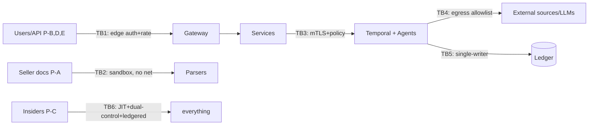

# DealPilot — Threat Model
Status: Approved · Owner: Security Lead · Method: STRIDE-per-component + attacker personas + abuse cases · Reviewed quarterly and on every RFC (§8).

## 1. What We Protect (assets, ranked)

1. **Ledger integrity** — the hash chain *is* the company's promise; a successful forgery is existential (Risk R-1 adjacent).
2. **Evidence store (CAS)** — tamper or poison here corrupts everything downstream.
3. **Tenant data confidentiality** — deal documents are customers' most sensitive material.
4. **Prompts, rubrics, model configs** — tampering silently changes judgments.
5. **Credentials/keys** — customer API keys, model provider keys, Stripe.
6. **Availability of the verification pipeline** — SLA-bound.

## 2. Attacker Personas

| ID | Who | Capability | Motivation |
|---|---|---|---|
| P-A | **Adversarial seller/broker** | Crafts hostile documents; no system access | Get bad deal marked favorable |
| P-B | Opportunistic external attacker | Scanning, credential stuffing, OWASP-class | Data theft, ransom |
| P-C | Malicious/compromised insider | Legit access within role | Sabotage, exfil, rubric tampering |
| P-D | Competitor | Scraping, API abuse, poaching corpora | Copy the moat |
| P-E | Fraudulent buyer/user | Paid account | Launder credibility; free compute |
| — | Nation-state | Out of scope pre-Series B (documented residual) | — |

## 3. STRIDE by Critical Component

**Evidence ingestion & parsing** (front door for P-A)
- *Tampering*: poisoned documents, hidden text, injection payloads → sandboxed network-less parsing, OCR/text-layer diffing, instruction/data separation, privilege architecture (`ai-architecture.md` §6). 
- *Spoofing*: fake "authoritative" sources → source adapters pin domains + TLS, tier assignment is code-reviewed config, no user-supplied "authoritative" sources.
- *DoS*: zip bombs, 5-GB PDFs → size/time/memory caps, fail-closed to UNKNOWN.

**Verification pipeline (agents + Temporal)**
- *Elevation*: injected model output triggering privileged tools → per-role tool allowlists, workflow owns control flow, no self-expanding loops (§3–4 of ai-architecture).
- *Tampering*: prompt/rubric drive-by edits → GitOps-only deploys, dual-control approvals, hashes in ledger events (detection is inherent).
- *Repudiation*: "the model never said that" → full replay from ledger with model_versions + prompt hashes.

**Ledger & event store**
- *Tampering*: rewrite history → append-only schema privileges (no UPDATE/DELETE grants), hash chain, off-site chain-head anchoring (daily head hash to independent write-once storage), OSS offline verifier as public detection.
- *Spoofing*: forged events → single-writer-per-stream via workflow identity (ADR-013), workload identity, event schema signing at export.
- *Info disclosure*: PII in immutable payloads → field-level encryption pre-chain (crypto-shred design, `security.md` §4).

**API & gateway**
- *Spoofing/Elevation*: stolen keys, IDOR, cross-tenant → hashed keys, anomaly detection, 3-layer authz + Postgres RLS backstop + standing cross-tenant probe suite in CI.
- *DoS*: expensive-endpoint abuse → credits as economic throttle + per-tenant concurrency caps + edge limits.

**Billing**
- *Tampering*: credit ledger manipulation → event-sourced balance (fold of ledgered events), invariants tested, nightly Stripe reconciliation (`../business/pricing.md`).
- *Repudiation*: usage disputes → ledgered consumption per run, exportable to customer.

## 4. Top Threats (ranked: Likelihood × Impact)

| # | Threat | L | I | Score | Primary mitigations | Residual |
|---|---|---|---|---|---|---|
| T-1 | Prompt injection via seller docs (P-A) → wrong statuses | H | H | 9 | Privilege separation, Composer isolation, injection CI corpus, anomaly tripwires | Novel injections land as REPORTED noise, not VERIFIED — accepted |
| T-2 | Evidence poisoning (fake source content) | M | H | 6 | Source tiering, independence checks for CORROBORATED, adapter pinning, provenance mandatory | Sophisticated multi-source poisoning → human review triggers |
| T-3 | Ledger forgery/rewrite attempt | L | Crit | 6 | Append-only grants, chain, external anchoring, OSS verifier | Insider with DB superuser → anchoring makes it *detectable*, dual-control limits access |
| T-4 | Tenant isolation breach | L | Crit | 6 | RLS backstop, probe suite, per-org keys | App-layer bug caught by RLS; RLS bug is the residual — pen-test focus area |
| T-5 | Credential stuffing / key theft | H | M | 6 | MFA, hashed keys, anomaly freeze, short JWTs | — |
| T-6 | Model/provider key theft → cost + data exposure | M | M | 4 | Vaulted, rotated 90 d, egress-proxied, zero-retention DPAs | — |
| T-7 | Economic DoS (mass expensive runs) | M | M | 4 | Credits, concurrency caps, per-run hard budget ($9 kill) | — |
| T-8 | Insider rubric/prompt tampering (P-C) | L | H | 4 | GitOps + dual-control + ledger hashes + quarterly access review from ledger | Collusion of two approvers — accepted, board-visible |
| T-9 | Competitor scraping memos/corpora (P-D) | M | M | 4 | Rate limits, watermarking on free tier, ToS + legal, export telemetry | Determined scraping of *paid* output — accepted |
| T-10 | Supply-chain compromise (dep/action) | M | H | 6 | Pinned SHAs, cool-down, SBOM+signing, admission verification | Zero-day upstream — detection posture |

## 5. Abuse Cases (misuse of a working product)

| Abuse | Vector | Control |
|---|---|---|
| **Laundered credibility** — tampered "DealPilot memo" shown to a counterparty | P-E edits an export | Exports carry chain hash + QR; public verifier check; "Verify this memo" page; ToS + trademark enforcement |
| Sellers gaming the rubric (structuring claims to hit CORROBORATED via captive sources) | P-A | Independence tests (ownership/origin), tier caps for correlated sources, rubric red-team backlog |
| Using outputs as consumer credit / securities marketing material | customer | ToS prohibitions (`../legal/tos.md` §3), watermark language, enterprise contract terms, marketing-must-pass-doctrine internally |
| Jailbreak to extract "advice" ("just tell me to buy") | any user | Composer templates have no advice slot; refusal states; advice-language linter on outputs (`../legal/compliance.md` §6) |
| Free-tier farming for competitor eval data | P-D | Watermarked UNVERIFIED outputs, velocity + fingerprint limits |

## 6. Trust Boundaries (summary diagram)

## 7. Assumptions & Out of Scope (honest ledger)

Assumed: AWS/KMS/Stripe/WorkOS uphold their controls (SOC 2 on file); Temporal Cloud isolation. Out of scope v1: nation-state, physical attacks, malicious model *providers* (mitigated only contractually + two-provider evals). Each accepted risk has an owner + review date in `../business/risk-register.md`.

## 8. Process

Living document: every RFC includes a **threat-model delta** section (new components/tools/boundaries → this doc updates in the same PR). Quarterly tabletop rotates through T-1..T-4 scenarios; pen tests target T-4 and TB2 explicitly. Findings feed the risk register with owners and dates.
